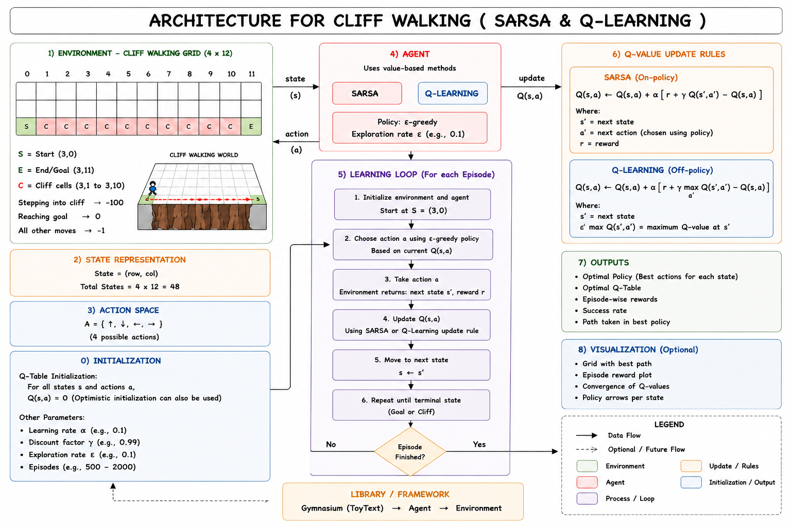

# SARSA on Cliff Walking
 

 
## Overview
 
This project implements the SARSA (State-Action-Reward-State-Action)  & Q-Learning RL-algo to solve the Cliff Walking environment. The agent learns a policy to navigate from start to goal while avoiding a cliff, using an epsilon-greedy exploration strategy and a tabular Q-value update.
 
## Reference

- Source: [Gymnasium.github](https://github.com/Farama-Foundation/Gymnasium)
- Library: [Gymnasium.docs](https://gymnasium.farama.org/)
- Environment: `CliffWalking-v1`
  
## Requirements
 
```bash
pip install gymnasium
pip install "gymnasium[toy-text]"
```

- `SARSA_cliff.ipynb` - main notebook containing the SARSA implementation
- `Q_Learning.ipynb` - main notebook containing the Q-Learning implementation
  
## How It Works
 
1. Initialize a Q-table of shape `(48, 4)` (48 states, 4 actions).
2. Use an epsilon-greedy policy to select actions (explore vs exploit).
3. For each episode, take a step, observe the next state and action, and update the Q-value using the SARSA update rule:
   
```
 [SARSAS] -  Q(s, a) += alpha * (reward + gamma * Q(s', a') - Q(s, a))
```
```
[Q-learn] - Q(s, a) += alpha * (reward + gamma * max Q(s', a') - Q(s, a)) 
```
 
4. Repeat for a fixed number of episodes to let the agent learn the optimal policy.
5. Run the learned (greedy) policy with rendering to visualize the agent's behavior.

 
## Heads Up - 
 
- Q-Learning being the best overall as it learns the optimal shortest path with less unnecessary movement, making it more efficient in terms of steps and return. SARSA tends to learn a safer policy because it accounts for the actions chosen during exploration, which can lead the agent further away from the cliff and reduce the risk of falling.
- Rendering during training is disabled by default since it slows down training significantly.
- After training, the final cell runs the greedy policy with `render_mode="human"` to visually verify the learned behavior.
